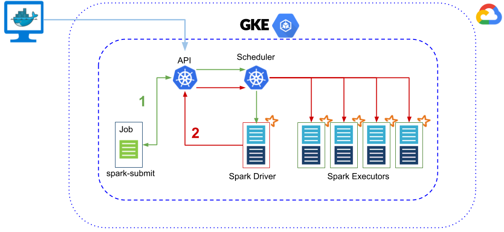
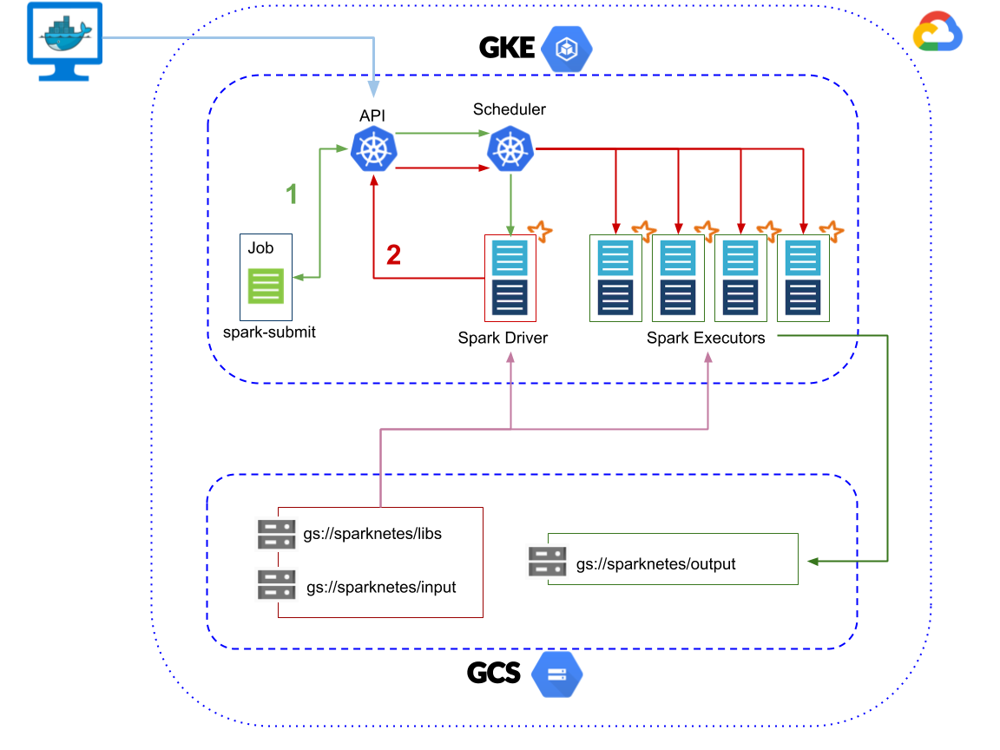
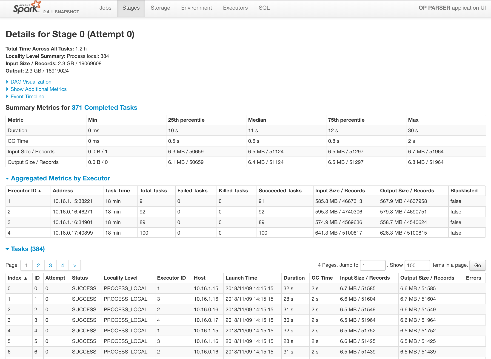
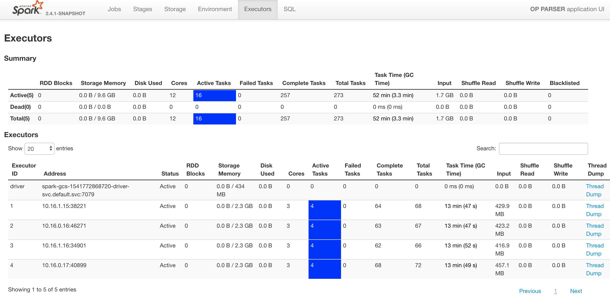

# Sparknetes
[](https://circleci.com/gh/hypnosapos/sparknetes/tree/master)
[](https://microbadger.com/images/hypnosapos/sparknetes)
[](https://microbadger.com/images/hypnosapos/sparknetes)
[](https://microbadger.com/images/hypnosapos/spark)

Spark on kubernetes. Based on [official documentation of spark 2.4](https://spark.apache.org/docs/2.4.0/running-on-kubernetes.html)

## Requirerements:

- Make (gcc)
- Docker (17+)
- Kubernetes 1.8+ 

## Spark docker images

In order to get base docker images to use with the `spark-submit` command we may use this intermediate one:

```bash
make sparknetes-build spark-images
```
> NOTE: This process may take you several minutes (~20 mins, under the wood there is a maven packaging task running).
 Take a look at Makefile file to view default values and other variables.

We've left docker images available at [dockerhub/hypnosapos](https://hub.docker.com/r/hypnosapos/) (sparknetes and spark images)

You could push your own images as well by:

```bash
DOCKER_ORG=<registry_org> DOCKER_USERNAME=<registry_user> DOCKER_PASSWORD=<registry_pass> make sparknetes-build spark-images
```

## Kubernetes cluster

Examples will be tested on GKE service, [here you have instructions to create a kubernetes cluster](https://github.com/hypnosapos/k8s-gke)).

When we've got our kubernetes cluster ready (for instance with `GKE_CLUSTER_NAME=spark` variable exported) we have to prepare a minimal bootstrapping operation:

```bash
export GKE_CLUSTER_NAME=spark
make gke-spark-bootstrap
```

## Launch basic examples



As the picture above shows you, `spark-submit` commands will be thrown from a pod of a kubernetes job.

First example is the well known SparkPi:
```bash
make spark-basic-example
```

Logs of jobs may be tracked on this way:
```bash
JOB_NAME=<job_name> make gke-job-logs
```
> NOTE: <job-name> is the name of the example with the suffix '-job' instead of '-example' (i.e. "spark-basic-job" instead of "spark-basic-example")

If it run successfully, spark-submit command should outline something like this:
```
2018-05-27 14:00:16 INFO  LoggingPodStatusWatcherImpl:54 - State changed, new state:
	 pod name: spark-pi-63ba1a53bc663d728936c24c91fb339b-driver
	 namespace: default
	 labels: spark-app-selector -> spark-2a6817ac76a248ba8a9cef7f3b988d82, spark-role -> driver
	 pod uid: 4698a7b8-61b6-11e8-b653-42010a840124
	 creation time: 2018-05-27T14:00:13Z
	 service account name: spark
	 volumes: spark-token-92jw7
	 node name: gke-spark-default-pool-ba0e670d-w989
	 start time: 2018-05-27T14:00:13Z
	 container images: hypnosapos/spark:2.4
	 phase: Succeeded
2018-05-27 14:00:16 INFO  LoggingPodStatusWatcherImpl:54 - Container final statuses:
Container name: spark-kubernetes-driver
	 Container image: hypnosapos/spark:2.4
	 Container state: Terminated
	 Exit code: 0
2018-05-27 14:00:16 INFO  Client:54 - Application spark-pi finished.
```

Second example is a linear regression, let's launch the log watcher in line too:
```bash
JOB_NAME=spark-ml-job make spark-ml-example gke-job-logs
```

## GCS example



This example uses a remote dependency for GCS connector and the GCP credentials to authenticate with internal metadata server.
We've used a private jar and class (provide your values directly in Makefile file, quoted by marks **\< \>**), but essentially you only need update your code to use `gs://` instead the typical `hdfs://` scheme for data input/output.

```bash
JOB_NAME=spark-gcs-job make spark-gcs-example gke-job-logs
```

In order to view the driver UI through a public load balance service:
```bash
export SPARK_APP_NAME=spark-gcs
make gke-spark-expose-ui
```

```bash
make gke-spark-open-ui
```





## Using spark-k8s operator

Few months ago google community published the [k8s-spark-operator](https://github.com/GoogleCloudPlatform/spark-on-k8s-operator).
Thus, it's time to check it out:

```bash
make gke-spark-operator-install
make gke-spark-operator-example
```

## Cleaning

Remove all spark resources on kubernetes cluster:

```bash
make gke-spark-clean
```

## TODO
- [ ] Benchmarks.
- [ ] BigDL examples and analytics zoo use cases.
